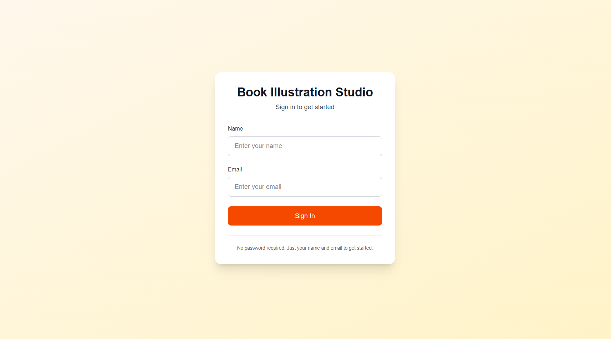
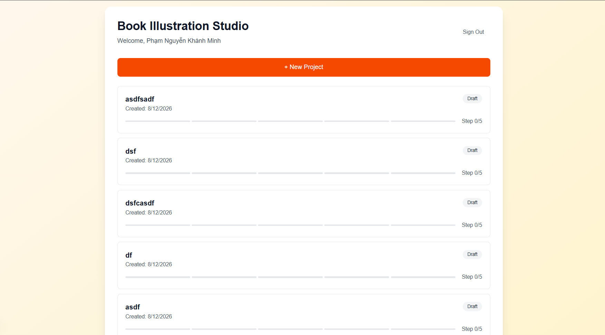
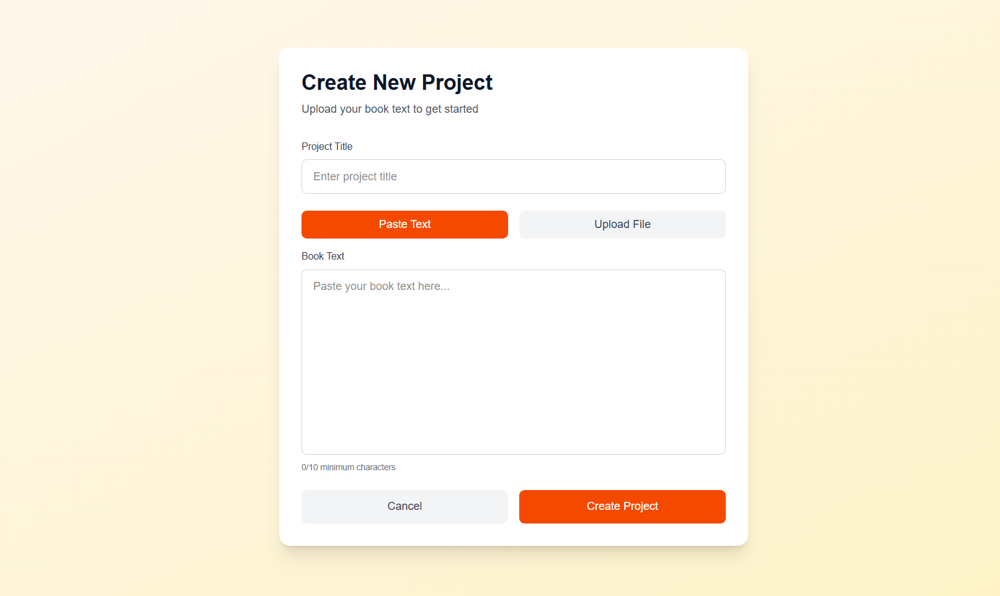
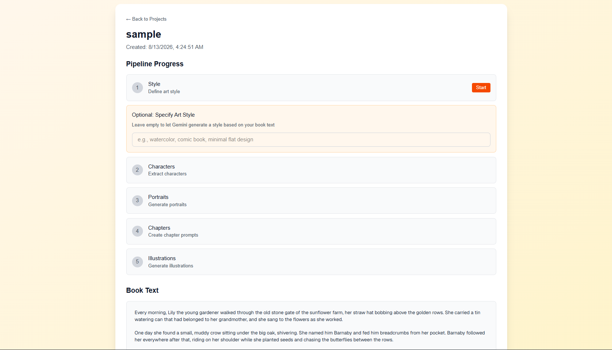

# Book Illustration Studio

A web app that turns a book's text into character portraits and a chapter illustration using the Gemini API. Five steps, run one at a time by the user: **Style → Characters → Portraits → Chapters → Illustrations**.

## Screenshots

| | |
| --- | --- |
| Sign in | Project list |
|  |  |
| New project | Pipeline result |
|  |  |

## Architecture

- **Frontend** — Next.js 16 + React 19 + TypeScript + Tailwind. Polls the backend while a step runs so each generated item appears as it lands.
- **Backend** — FastAPI. One `main:app` process; pipeline steps run in a threadpool so polling stays responsive during long Gemini calls.
- **Storage** — JSON files on disk (state isolated per user/project) + book text and images on the local filesystem, served through the API. No database.
- **Gemini** — `google-genai` SDK, notebook-faithful pipeline (file upload once, interaction-chained context, structured JSON output). Image generation defaults to `mock` because every current Gemini image model is paid-only (see [DECISIONS.md](DECISIONS.md)).

## Prerequisites

- Python 3.9+
- Node.js 18+
- `make` (GNU Make)
- A Gemini API key — free tier covers the text pipeline; image models are paid-only

## Quick Start

```bash
# 1. Install backend (venv) + frontend (node_modules)
make setup

# 2. Configure env
cp .env.example backend/.env
# edit backend/.env -> set GEMINI_API_KEY
cp frontend/env.local.example frontend/.env.local   # optional; localhost:8000 is the default

# 3. Start the stack (backend :8000, frontend :3000)
make dev

# 4. Run tests
make test
```

`make setup`, `make dev`, and `make test` are the three entry points. Underneath:

- `make dev-backend` / `make dev-frontend` — run either side on its own
- `make test-backend` / `make test-frontend` — run either test suite alone

## Environment Variables

| Variable | Where | Default | Description |
| --- | --- | --- | --- |
| `GEMINI_API_KEY` | `backend/.env` | — | Real key, required. **Never commit it.** |
| `IMAGE_PROVIDER` | `backend/.env` | `mock` | `mock` = local placeholders, no cost. `gemini` = real Nano Banana calls (billing required). |
| `NEXT_PUBLIC_API_URL` | `frontend/.env.local` | `http://localhost:8000` | Backend base URL for the frontend. |

## Project Layout

```
backend/
  main.py            # uvicorn entrypoint (main:app)
  app/
    api/             # routes: auth, projects, steps, retry, images
    clients/         # Gemini client + MockImageClient
    services/        # pipeline: the 5-step flow + caps
    repositories/    # JSON file storage + write locks
    models/          # pydantic schemas
  tests/             # pytest
frontend/
  app/               # Next.js pages + components + lib/api.ts
  app/__tests__/     # jest
data/                # users/, projects/, files/, images/ (gitignored)
```

## Pipeline Steps

1. **Style** — art style for the book: user-supplied or generated from the book text
2. **Characters** — structured list of the main **adult** characters with image prompts, **max 2** (server-side cap)
3. **Portraits** — one portrait image per character (9:16)
4. **Chapters** — structured list of chapter illustration prompts referencing the characters, **max 1** (server-side cap)
5. **Illustrations** — one scene illustration per chapter (16:9), reusing the portraits for character consistency

Caps are enforced in the pipeline, not just the UI. See [DECISIONS.md](DECISIONS.md) for the pipeline and storage decisions, and [TESTING.md](TESTING.md) for the test strategy and real reports.